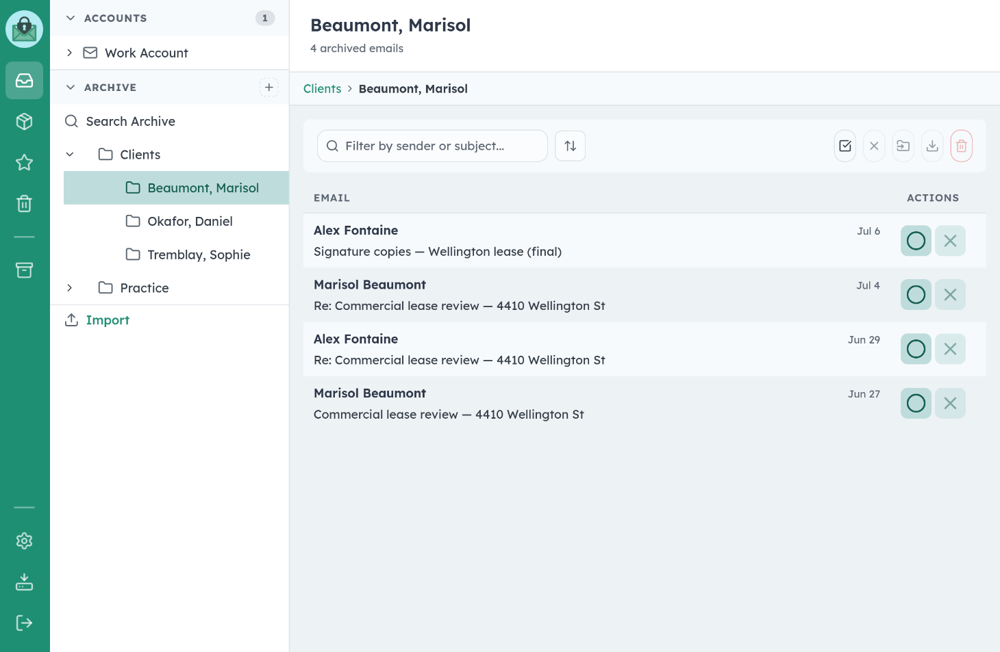
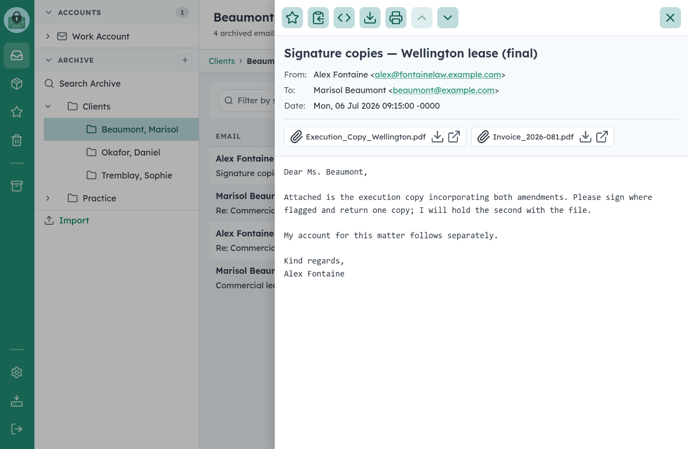
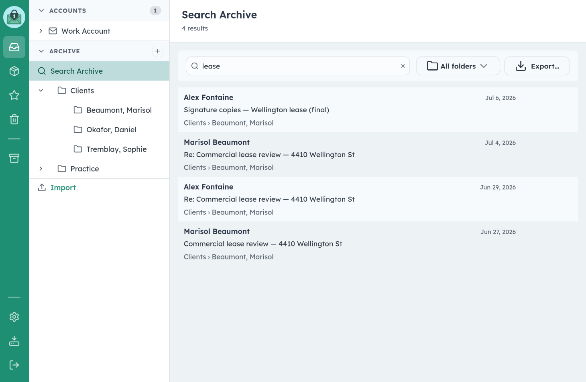
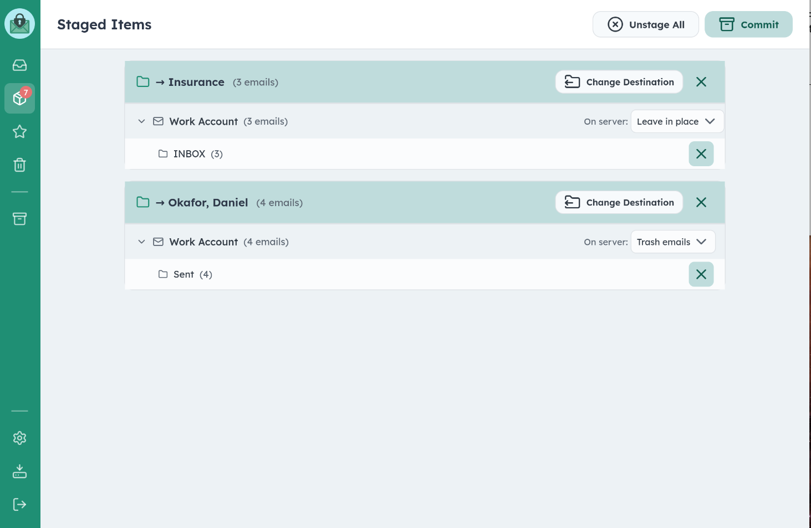

# MailRepo

**Encrypted email archiving for solo practitioners.**

> Your correspondence, your machine, your control.

Therapists, lawyers, accountants, and journalists handle sensitive client correspondence every day. Most email is stored on servers where administrators can read it in plaintext. MailRepo lets you archive that correspondence locally, encrypted with a password only you know — no cloud, no third parties, no exposure.



<p align="center">
  
  
</p>

---

## Download

**Current release: [1.0.0](https://github.com/rsembera/mailrepo/releases/tag/v1.0.0)**

| Platform | File | SHA-256 |
|---|---|---|
| macOS 11+ (Apple Silicon) | [MailRepo-1.0.0.dmg](https://github.com/rsembera/mailrepo/releases/download/v1.0.0/MailRepo-1.0.0.dmg) | `2cce5321474f9ac373dc9a8c2b3c762464df2a1318443baaff13cc5dac76d3dc` |
| Debian 13 (Trixie), amd64 | [mailrepo_1.0.0_amd64.deb](https://github.com/rsembera/mailrepo/releases/download/v1.0.0/mailrepo_1.0.0_amd64.deb) | `73c974df41511862d9b0fc862569162cc3c2f29cbd5d7c9ba027e136d8804d96` |

The macOS app is signed and notarized. Install the .deb with `sudo apt install ./mailrepo_1.0.0_amd64.deb` — dependencies resolve automatically.

Verify a download with `shasum -a 256 <file>` (macOS) or `sha256sum <file>` (Linux) and compare against the table.

Windows is not yet supported (planned).

---

## Features

- **Encrypted at rest** — Every archived email and your entire database are encrypted. Without your master password or your recovery key, the files are unreadable — by anyone.
- **A native desktop app** — One window, like any other app, on macOS and Linux.
- **Recovery key** — Generated at setup, shown once, yours to print. If you forget your password, the recovery key opens the archive and lets you set a new one. Check it or rotate it any time in Settings.
- **IMAP support** — Connects to Gmail, iCloud, Fastmail, and any standard IMAP server using app-specific passwords. Your email password is never stored in plaintext.
- **Stage → Review → Commit workflow** — Browse your inbox, select emails to file, review your selections, then commit them to your archive in one batch. Nothing enters the archive without your explicit say-so.
- **Import existing archives** — Bring in existing email from .mbox files (including Apple Mail exports), individual .eml files, and Outlook .pst files.
- **Full-text search** — Search across subjects, senders, recipients, and email body text, entirely offline, inside the encrypted archive.
- **PDF export and printing** — Export folders or single emails as clean, court-and-client-ready PDFs.
- **Export as ZIP** — Export any folder as standard .eml files you can open in any email client. Your data is never locked in.
- **Backup and restore** — Full and incremental backups with integrity manifests, including an automatic backup when you close the app.
- **Retention vault** — Permanently delete emails with a clear audit trail.

---

## Who It's For

MailRepo is designed for solo practitioners who need to:

- Keep client correspondence records for compliance (HIPAA, PHIPA, legal privilege)
- Maintain an organized archive without relying on cloud storage
- Ensure that sensitive correspondence is encrypted and under their direct control

It is a **single-user, local application**. It runs entirely on your machine. It is not a cloud service, has no accounts, no telemetry, and does not phone home.

---

## First Run

1. **Set a master password.** It protects everything. Choose something strong.

2. **Save your recovery key.** Setup generates one and shows it once — print it or write it down, and store it somewhere as safe as the archive itself. If you lose your password, the recovery key is the way back in. If you lose both, the archive stays locked forever; that is the design.

3. **Import or connect.** Point MailRepo at an .mbox/.eml/.pst export, or connect an IMAP account (use an app-specific password for Gmail and iCloud — MailRepo auto-detects server settings for common providers).

---

## How the Workflow Works

**Browse & Stage** — Select an account or import from the sidebar and browse. Check the emails you want to archive. A badge tracks how many you've staged. You can browse multiple folders and accounts before committing.

**Review** — Click Review to see all staged emails grouped by source. You can change the destination folder, remove individual emails from the batch, and choose what happens to the originals on the server (leave in place, move to trash, delete).

**Commit** — Click Commit. MailRepo fetches each email, encrypts it, saves it to your archive, and updates the database. Progress is shown in real time. Any failures are reported, and retrying is safe — already-archived emails are recognized and skipped.



---

## Security Model

| Data | Protection |
|------|------------|
| Master key | Random 256-bit key, generated at setup; never stored unwrapped |
| Your password | Argon2id (m=256 MiB, t=6, p=1) derives a key that *wraps* the master key |
| Recovery key | Independently generated (160-bit); wraps a second copy of the master key |
| Database | SQLCipher (AES-256), keyed via HKDF from the master key |
| Archived emails | AES-256-GCM with per-file random nonce, keyed via HKDF from the master key |
| IMAP credentials | AES-256-GCM |
| File format | `[0x02][12-byte nonce][ciphertext][16-byte GCM tag]` |

Because your password and your recovery key each wrap the *same* master key, either one opens the archive — and changing your password just replaces one wrapper, instantly, with no re-encryption of the archive. The database key and file key are derived from the master with distinct HKDF labels, so a key valid for one purpose cannot be substituted for the other.

The Argon2id parameters are deliberately memory-hard: each password guess costs 256 MiB of RAM and most of a second, which is what makes GPU-farm brute force uneconomical.

MailRepo's internal server binds to `127.0.0.1` only and accepts no connections from other machines. For remote access from your own devices, [Tailscale](https://tailscale.com) works well.

---

## Running from Source

The packaged apps above are the recommended way to use MailRepo. Running from source is for development, other Linux distributions, or the curious.

### Requirements

- Python 3.13 or later
- macOS or Linux
- For PST import: `libpst` (`brew install libpst` / `sudo apt install pst-utils`)

### Steps

```bash
git clone https://github.com/rsembera/mailrepo.git
cd mailrepo
python3 -m venv venv
source venv/bin/activate
pip install -r requirements.txt
python main.py
```

Then open **http://localhost:5050** in your browser. (`python main.py --dev` enables auto-reload; `--port=8080` changes the port. To get the native desktop window instead of a browser tab, `pip install pywebview` and run `python launcher.py`.)

### Data locations

The packaged apps keep your archive in the standard per-user data directory — `~/Library/Application Support/MailRepo` on macOS, `~/.local/share/mailrepo` on Linux. Running from source defaults to the repository directory. Either way, `MAILREPO_DATA_DIR` overrides the location, and **backup = copy that folder**: everything MailRepo needs is in it, encrypted.

### Troubleshooting

**SQLCipher fails to install (from source):** install the C library first — macOS `brew install sqlcipher`, Debian `sudo apt install libsqlcipher-dev` — then retry `pip install`.

**Gmail connection refused:** Gmail requires an [App Password](https://support.google.com/accounts/answer/185833); your regular Google password will not work.

---

## Credits

MailRepo was designed by Richard Sembera and coded with Anthropic's Claude — Opus 4.5–5 and Fable 5.

---

## License

GNU Affero General Public License v3.0. See [LICENSE](LICENSE) for details.

The AGPL requires that if you modify and deploy this software to provide a service to others, you must make your modified source code available. For personal use, no restrictions apply.
